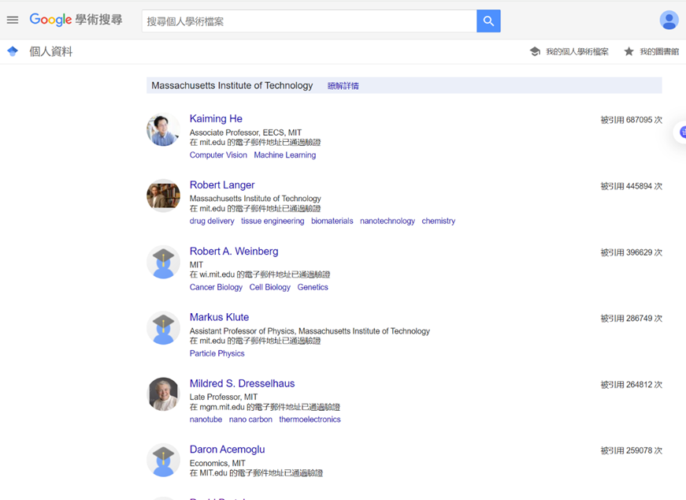

最严重的问题：

爬取网页数据时，会漏掉很多人，比如在MIT的第一页中，网页中情况是：



但是获得数据时，前几行是这样的，显然漏了很多人，且错误不是随机发生的，第一次爬不到的几遍都爬不到：

```json
{
"Robert Langer": ['Massachusetts Institute of Technology', [0, 'drug delivery', 'tissue engineering', 'biomaterials', 'nanotechnology', 'chemistry'], 445798],
"Markus Klute": ['Massachusetts Institute of Technology', [0, 'Particle Physics'], 286686],
"John Joannopoulos": ['Massachusetts Institute of Technology', [0], 189379],
"Feng Zhang": ['Harvard University', [0, 'neuroscience', 'microbiology', 'optogenetics', 'genome engineering'], 182053],
"Moungi G. Bawendi": ['Massachusetts Institute of Technology', [0], 174134],
"Dimitri Bertsekas": ['Massachusetts Institute of Technology', [0, 'Optimization and Control', 'Large-Scale Computation'], 139511],
"DH Shoemaker": ['Massachusetts Institute of Technology', [0, 'Gravitational Wave detection'], 138068],
"Stephen L. Buchwald": ['Massachusetts Institute of Technology', [0, 'organic synthesis', 'organometallic chemistry', 'catalysis', 'asymmetric catalysis', 'flow chemistry'], 136337],
}
```

我暂无解决办法

Comment by Zhouyue: 可能是URL问题


问题2：爬取速度过慢，一页里有10个教授，爬取每个教授信息仅需要0.05秒，但是为了防止触发google scholar检测自动程序，每次翻页要sleep10秒，导致我的电脑花了3个小时，才获得了QS排名前十学校可获得的引文前1000教授。

如果以现在的情况，仅仅要爬 QS前60的大学每所里引文前1000，就要一天一夜，而且中途梯子不能断，不能触发人机验证，不能被封IP。

所以急切需要更高效的爬取方法

 

Comment by Zhouyue：可能要用个代理池来反反爬虫


问题3：由于本人才疏学浅，无法将获得的文本文档变成json，进行方便的处理与查找，暂时只能用文本文档查找。

